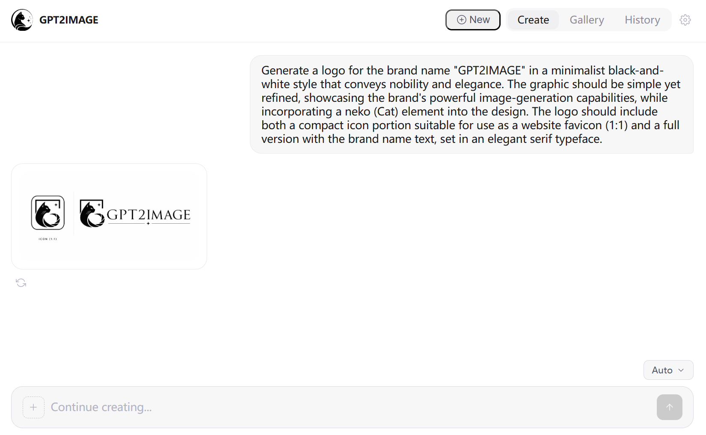

# GPT2Image

<p align="center">
  
</p>

<p align="center">
  A lightweight, pure-frontend chat-to-image generation web app.<br>
  Connect to any OpenAI-compatible API and create images through natural conversation.
</p>

<p align="center">
  <a href="README_CN.md">中文文档</a>
</p>

## Features

- **Conversational Image Generation** — Describe what you want, get images in a chat flow
- **Image Editing** — Attach reference images for guided edits
- **Flexible Sizing** — Auto, preset ratios (1:1, 3:2, 2:3, 16:9, 9:16), 2K, 4K, or fully custom dimensions
- **Retry & Variants** — Regenerate any result; variants are kept as branches with `< 1/N >` navigation
- **Gallery & History** — Browse all generated images or revisit past conversations
- **Fullscreen Lightbox** — View images at full resolution with download support
- **Zero Backend** — Runs entirely in the browser; data stored in localStorage

## Preview

<p align="center">
  
</p>

## Quick Start

1. Serve the `src/` directory with any static file server:

   ```bash
   cd src
   python -m http.server 8090
   ```

2. Open `http://localhost:8090` in your browser.

3. Enter your **API Base URL** and **API Key** on the settings page, then start creating.

## Project Structure

```
src/
├── index.html              # Entry point
├── favicon.ico             # Browser tab icon
├── assets/                 # Logo and icon images
├── css/style.css           # Design tokens and styles
└── js/
    ├── app.js              # Bootstrap and routing
    ├── router.js           # Hash-based SPA router
    ├── store.js            # localStorage persistence
    ├── api.js              # OpenAI Responses API client
    ├── icons.js            # SVG icon library
    ├── components/         # Reusable UI components
    │   ├── header.js
    │   ├── input-bar.js
    │   ├── image-card.js
    │   ├── lightbox.js
    │   └── toast.js
    └── views/              # Page views
        ├── settings.js
        ├── landing.js
        ├── chat.js
        ├── gallery.js
        └── history.js
```

## API Compatibility

GPT2Image calls the [OpenAI Responses API](https://platform.openai.com/docs/api-reference/responses) with the `image_generation` tool. Any OpenAI-compatible endpoint that supports this tool type will work.

**Tested configurations:**

| Model | Size Support |
|-------|-------------|
| gpt-4o / gpt-4.1 | Standard sizes (up to 1792 x 1024) |
| gpt-5.4 | Standard + 2K / 4K (up to 3840 x 2160) |

> Note: The **Model** field in settings refers to the chat model (e.g. `gpt-5.4`), not the image model. The underlying image model (`gpt-image-1` / `gpt-image-2`) is selected automatically by the API.

## License

MIT
