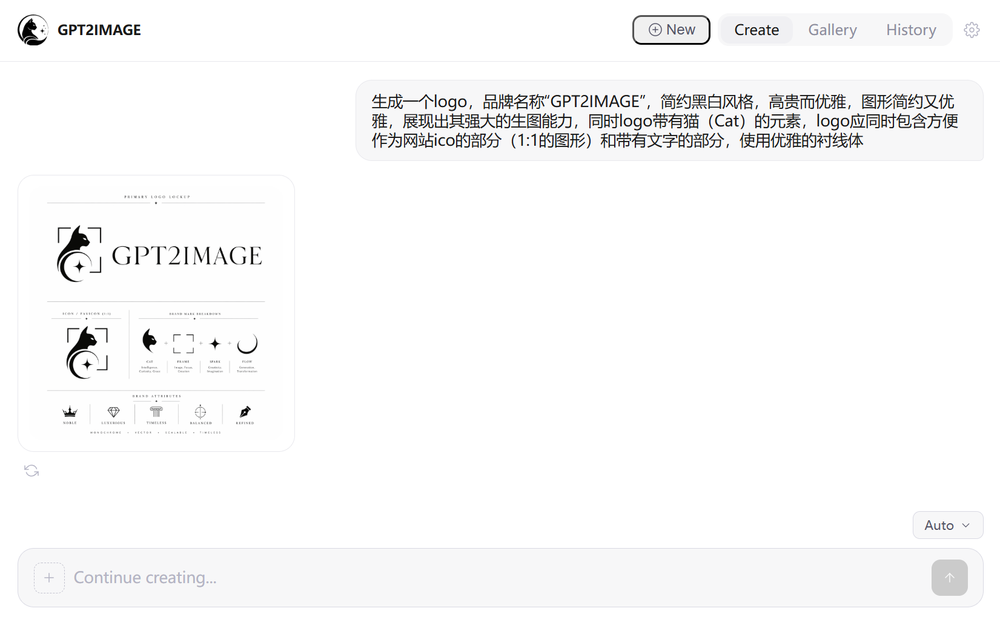

# GPT2Image

<p align="center">
  
</p>

<p align="center">
  轻量级纯前端对话生图 Web 应用。<br>
  连接任意 OpenAI 兼容 API，通过自然语言对话生成图片。
</p>

## 功能特性

- **对话式生图** — 用自然语言描述想要的图片，在聊天界面中即时生成
- **图片编辑** — 附加参考图片进行引导式编辑
- **灵活尺寸** — 自动、预设比例（1:1、3:2、2:3、16:9、9:16）、2K、4K 或完全自定义尺寸
- **重试与分支** — 对任意结果重新生成；多次生成的变体以分支形式保留，支持 `< 1/N >` 切换
- **画廊与历史** — 浏览所有生成的图片，或回顾过往对话
- **全屏灯箱** — 以原始分辨率查看图片，支持下载
- **零后端** — 完全运行在浏览器中，数据存储于 localStorage

## 预览

<p align="center">
  
</p>

## 快速开始

1. 使用任意静态文件服务器托管 `src/` 目录：

   ```bash
   cd src
   python -m http.server 8090
   ```

2. 在浏览器中打开 `http://localhost:8090`。

3. 在设置页面输入 **API Base URL** 和 **API Key**，即可开始创作。

## 项目结构

```
src/
├── index.html              # 入口页面
├── favicon.ico             # 浏览器标签页图标
├── assets/                 # Logo 和图标资源
├── css/style.css           # 设计变量和样式
└── js/
    ├── app.js              # 启动与路由注册
    ├── router.js           # 基于 hash 的 SPA 路由
    ├── store.js            # localStorage 持久化
    ├── api.js              # OpenAI Responses API 客户端
    ├── icons.js            # SVG 图标库
    ├── components/         # 可复用 UI 组件
    │   ├── header.js
    │   ├── input-bar.js
    │   ├── image-card.js
    │   ├── lightbox.js
    │   └── toast.js
    └── views/              # 页面视图
        ├── settings.js
        ├── landing.js
        ├── chat.js
        ├── gallery.js
        └── history.js
```

## API 兼容性

GPT2Image 调用 [OpenAI Responses API](https://platform.openai.com/docs/api-reference/responses) 的 `image_generation` 工具。任何支持该工具类型的 OpenAI 兼容端点均可使用。

**已测试的配置：**

| 模型 | 尺寸支持 |
|------|---------|
| gpt-4o / gpt-4.1 | 标准尺寸（最大 1792 x 1024） |
| gpt-5.4 | 标准 + 2K / 4K（最大 3840 x 2160） |

> 注意：设置中的 **Model** 字段填写的是聊天模型（如 `gpt-5.4`），而非图片模型。底层图片模型（`gpt-image-1` / `gpt-image-2`）由 API 自动选择。

## 许可证

MIT
